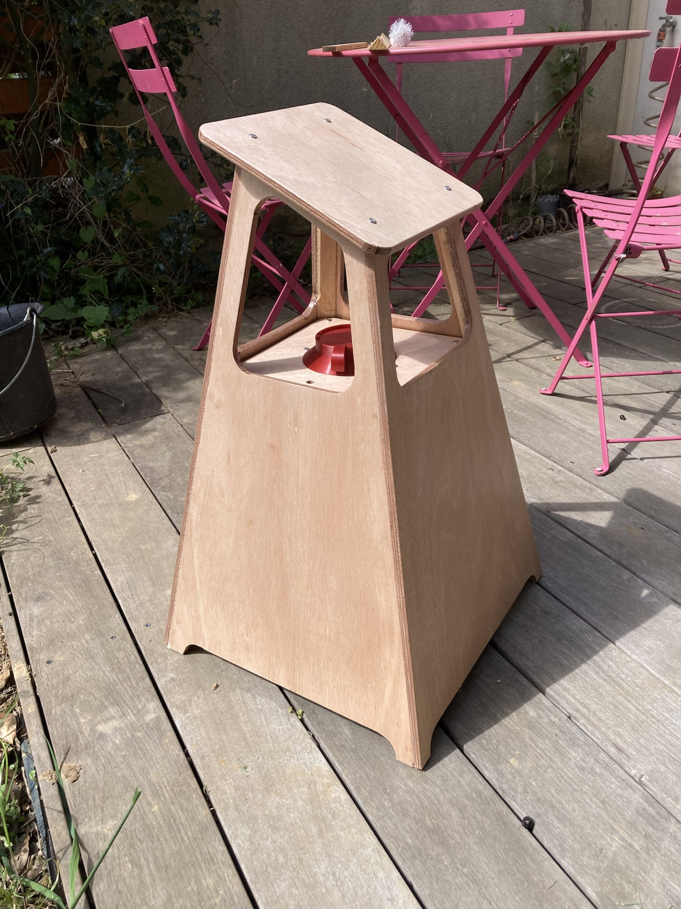
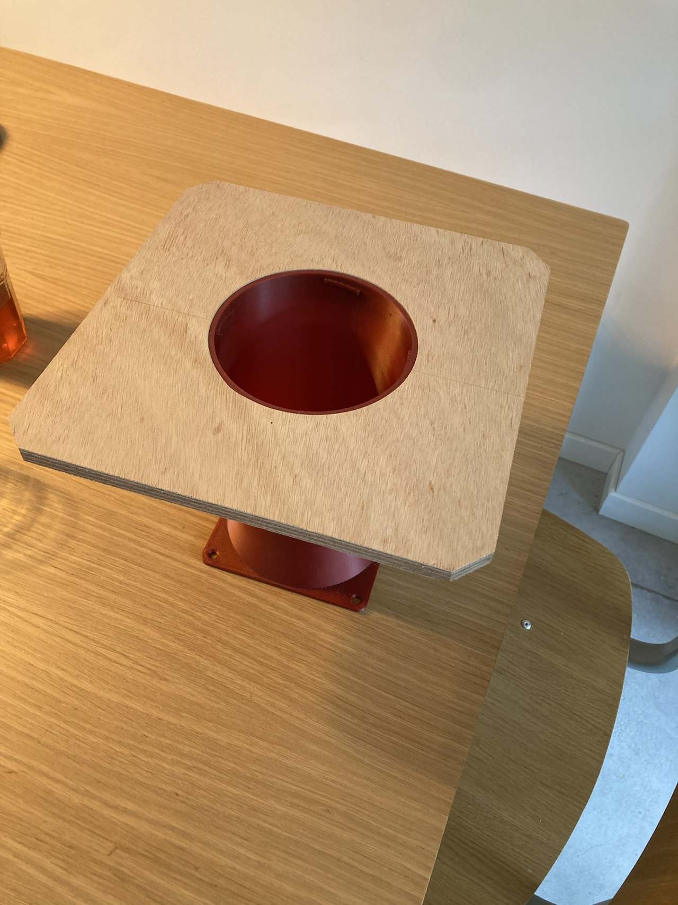
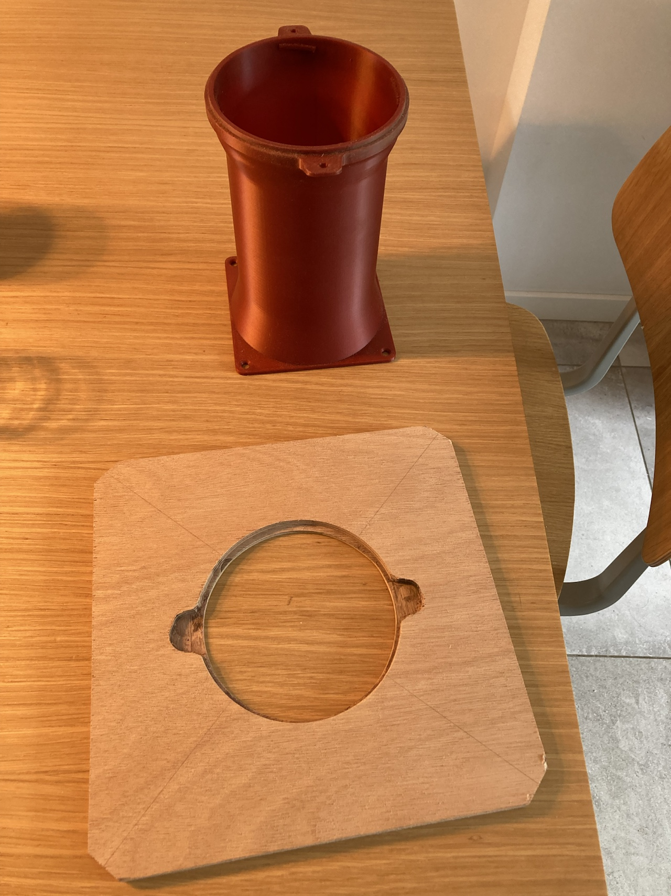
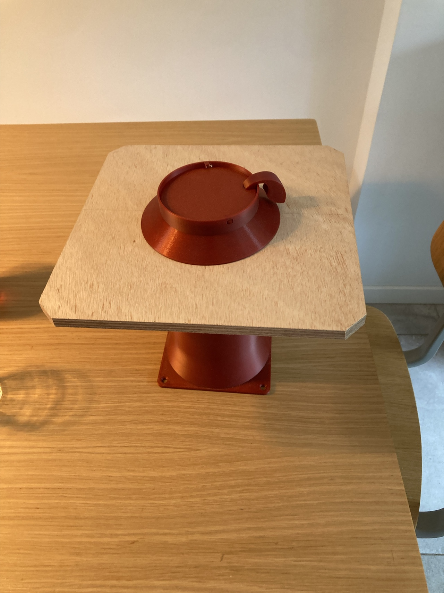
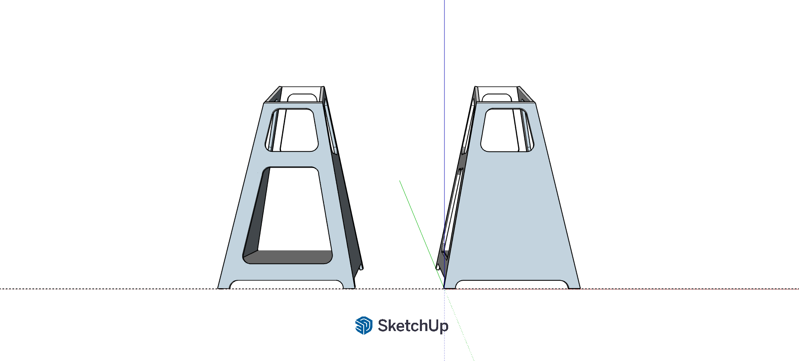
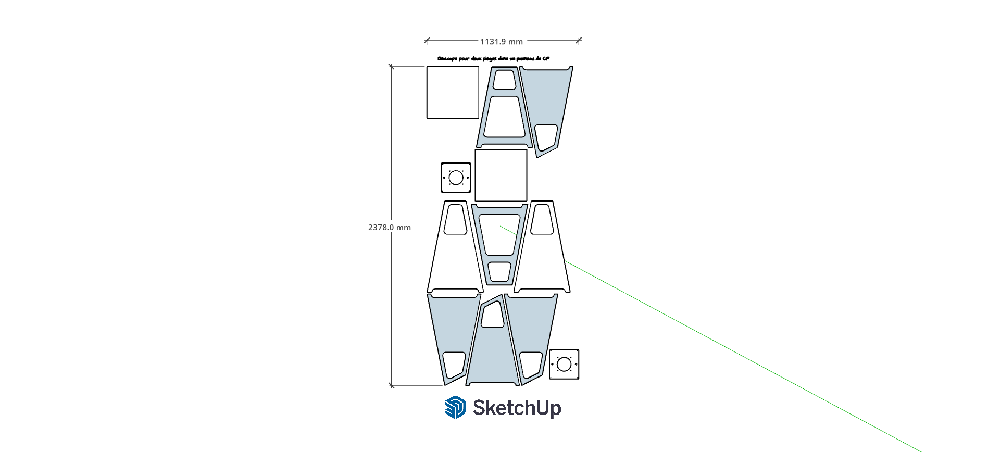
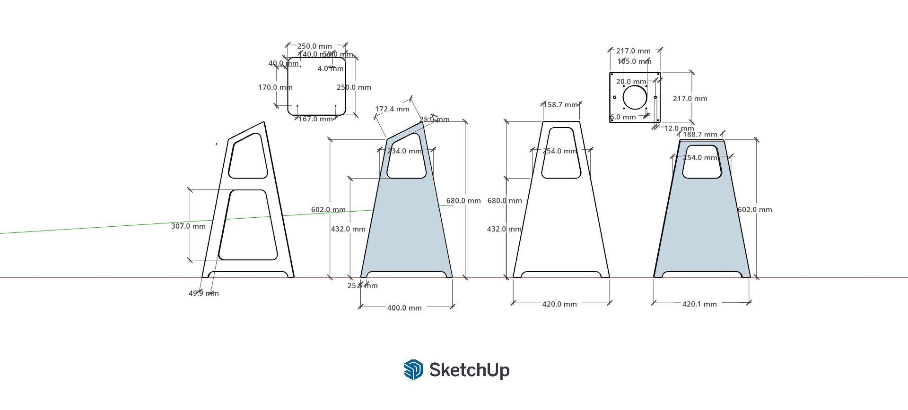

# LamiPerso
Ce travail est une production dérivative réalisée à partir du Lami V2 mis à disposition sous licence https://creativecommons.org/licenses/by-nc-sa/4.0/

Concu pour fonctionner avec le kit d'aspiration V3

  
  
  

## Différentes vues du model

  
  
  

[Modèle SketchUp](myLami.skp)
 

